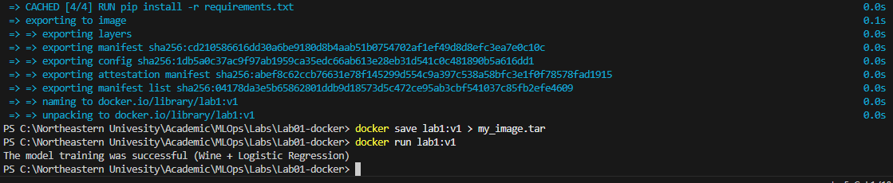

# 🐳 Lab 01 – Dockerizing a Machine Learning Training Pipeline

## 📌 Objective

The goal of this lab is to containerize a Machine Learning training script using Docker.  
This demonstrates how to create a reproducible ML environment using containerization.

The project trains a Logistic Regression model on the Wine dataset and saves the trained model inside the container.

---

## 📂 Project Structure

```
Lab01-docker/
│
├── Dockerfile
├── requirements.txt
└── src/
    └── main.py
```

---

## 🧠 Machine Learning Workflow

### Dataset
- Wine Dataset (from scikit-learn)

### Model
- Logistic Regression

### Pipeline
- StandardScaler (Feature Scaling)
- LogisticRegression (max_iter=5000, solver='lbfgs')

### Output
After successful training:

```
The model training was successful (Wine + Logistic Regression)
```

The trained model is saved as:

```
wine_model.pkl
```

---

## 🐳 Docker Configuration

### Base Image
```
python:3.10
```

### Dockerfile Explanation

```dockerfile
FROM python:3.10
```
Uses official Python runtime.

```dockerfile
WORKDIR /app
```
Sets working directory inside container.

```dockerfile
COPY src/ .
```
Copies ML script into container.

```dockerfile
RUN pip install -r requirements.txt
```
Installs required dependencies.

```dockerfile
CMD ["python", "main.py"]
```
Runs training script when container starts.

---

## 📦 Dependencies

Listed in `requirements.txt`:

```
scikit-learn
joblib
```

---

## 🚀 How to Run

### 1️⃣ Build Docker Image

```bash
docker build -t lab1:v1 .
```

---

### 2️⃣ Run Container

```bash
docker run lab1:v1
```

Expected output:

```
The model training was successful (Wine + Logistic Regression)
```

---

### 3️⃣ Save Docker Image as TAR

```bash
docker save lab1:v1 > my_image.tar
```

This exports the Docker image for portability.

---

## 🔍 Verify

List images:
```bash
docker images
```

List running containers:
```bash
docker ps
```

---

## 🎯 Key Concepts Demonstrated

- Dockerfile creation
- Image building
- Container execution
- Reproducible ML environments
- Dependency isolation
- Model serialization with joblib

---

## 👤 Author

Saheel Chavan  
MLOps – Northeastern University  
Spring 2026

Ran the above command sucessfully

